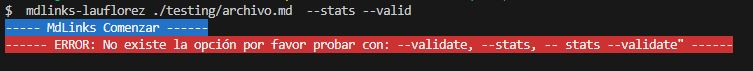

# Markdown Links

## Índice

* [1. Preámbulo](#1-preámbulo)
* [2. Resumen ](#2-resumen)
* [3. Consideraciones generales](#3-consideraciones-generales)
* [4. Diagramas de Flujo](#4-Diagramas-de-Flujo)
* [5. Comando de instalación ](#5-comando-de-instalación)
* [6. CLI ](#6-cli )
* [6. Pruebas unitarias ](#7-pruebas-unitarias)

***

## 1. Preámbulo

[Markdown](https://es.wikipedia.org/wiki/Markdown) es un lenguaje de marcado
ligero muy popular entre developers. Es usado en muchísimas plataformas que
manejan texto plano (GitHub, foros, blogs, ...) y es muy común
encontrar varios archivos en ese formato en cualquier tipo de repositorio
(empezando por el tradicional `README.md`).

Estos archivos `Markdown` normalmente contienen _links_ (vínculos/ligas) que
muchas veces están rotos o ya no son válidos y eso perjudica mucho el valor de
la información que se quiere compartir. 

Dentro de una comunidad de código abierto, nos han propuesto crear una
herramienta usando [Node.js](https://nodejs.org/), que lea y analice archivos
en formato `Markdown`, para verificar los links que contengan y reportar
algunas estadísticas.

## 2. Resumen 

Esta es una herramienta de línea de comando (CLI) y librería instalable que facilita la búsqueda y análisis de enlaces dentro de archivos markdown (extensión .md) y retorna un listado de enlaces que contiene el proyecto. Además si agregamos la opción:

**'--validate'** nos ayuda a comprobar la ruta, el texto y enlace

**'--stats'** nos saca una estadistica de cuales enlaces estan correctos o de lo contrario nos indica cuantos enlaces están rotos.

## 3. Consideraciones generales

## Este proyecto consta de DOS partes

### 1) JavaScript API

El módulo debe poder **importarse** en otros scripts de Node.js y debe ofrecer la
siguiente interfaz:

#### `mdLinks(path, options)`

##### Argumentos

* `path`: Ruta **absoluta** o **relativa** al **archivo** o **directorio**.
Si la ruta pasada es relativa, debe resolverse como relativa al directorio
desde donde se invoca node - _current working directory_).
* `options`: Un objeto con **únicamente** la siguiente propiedad:
  - `validate`: Booleano que determina si se desea validar los links
    encontrados.

##### Valor de retorno

La función debe **retornar una promesa** (`Promise`) que **resuelva a un arreglo**
(`Array`) de objetos (`Object`), donde cada objeto representa un link y contiene
las siguientes propiedades

Con `validate:false` :

* `href`: URL encontrada.
* `text`: Texto que aparecía dentro del link (`<a>`).
* `file`: Ruta del archivo donde se encontró el link.

Con `validate:true` :

* `href`: URL encontrada.
* `text`: Texto que aparecía dentro del link (`<a>`).
* `file`: Ruta del archivo donde se encontró el link.
* `status`: Código de respuesta HTTP.
* `ok`: Mensaje `fail` en caso de fallo u `ok` en caso de éxito.

#### Ejemplo (resultados como comentarios)

```js
const mdLinks = require("md-links");

mdLinks("./some/example.md")
  .then(links => {
    // => [{ href, text, file }, ...]
  })
  .catch(console.error);

mdLinks("./some/example.md", { validate: true })
  .then(links => {
    // => [{ href, text, file, status, ok }, ...]
  })
  .catch(console.error);

mdLinks("./some/dir")
  .then(links => {
    // => [{ href, text, file }, ...]
  })
  .catch(console.error);
```

### 2) CLI (Command Line Interface - Interfaz de Línea de Comando)

El ejecutable de nuestra aplicación debe poder ejecutarse de la siguiente
manera a través de la **terminal**:

`md-links <path-to-file> [options]`

Por ejemplo:

```sh
$ md-links ./some/example.md
./some/example.md http://algo.com/2/3/ Link a algo
./some/example.md https://otra-cosa.net/algun-doc.html algún doc
./some/example.md http://google.com/ Google
```

El comportamiento por defecto no debe validar si las URLs responden ok o no,
solo debe identificar el archivo markdown (a partir de la ruta que recibe como
argumento), analizar el archivo Markdown e imprimir los links que vaya
encontrando, junto con la ruta del archivo donde aparece y el texto
que hay dentro del link (truncado a 50 caracteres).

#### Options

##### `--validate`

Si pasamos la opción `--validate`, el módulo debe hacer una petición HTTP para
averiguar si el link funciona o no. Si el link resulta en una redirección a una
URL que responde ok, entonces consideraremos el link como ok.

Por ejemplo:

```sh
$ md-links ./some/example.md --validate
./some/example.md http://algo.com/2/3/ ok 200 Link a algo
./some/example.md https://otra-cosa.net/algun-doc.html fail 404 algún doc
./some/example.md http://google.com/ ok 301 Google
```

Vemos que el _output_ en este caso incluye la palabra `ok` o `fail` después de
la URL, así como el status de la respuesta recibida a la petición HTTP a dicha
URL.

##### `--stats`

Si pasamos la opción `--stats` el output (salida) será un texto con estadísticas
básicas sobre los links.

```sh
$ md-links ./some/example.md --stats
Total: 3
Unique: 3
```

También podemos combinar `--stats` y `--validate` para obtener estadísticas que
necesiten de los resultados de la validación.

```sh
$ md-links ./some/example.md --stats --validate
Total: 3
Unique: 3
Broken: 1
```

## 4. Diagramas de Flujo

Se realizaron dos diagramas de Flujo para el API y CLI y asi poder visualizar mejor lo que se tiene que hacer y cumplir los objetivos.

**Diagrama de flujo API**


**Diagrama de flujo CLI**


## 5. Comando de nnstalacion 

En tu consola ejecuta el siguiente comando:

npm i mdlinks-lauflorez


## 6. CLI

Comandos para ejecutar en tu consola

 * Proyecta los links que se encuentran en los archivos md.
 


* Proyecta los links y sus status (fail en caso de fallo u ok en caso de éxito).


* Proyecta una estadistica de los links (total y unique ) .


* Proyecta una estadistica de los links (total, unique y broken) .


* Proyecta la ruta pero si no tiene enlaces envia un error.


* Proyecta si escribo la opción incorrecta.



## 7. Pruebas unitarias

Pruebas unitarias cubren un mínimo del 70% de statements, functions, lines, y branches y se realizaron 25.


